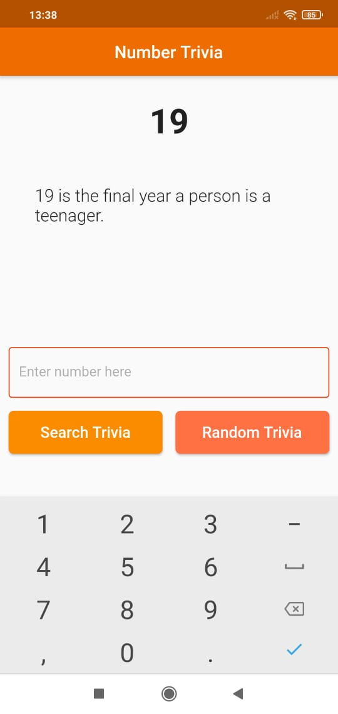

# Flutter Number Trivia

A Flutter application using "numbersapi.com" API.  
The project's goal is to practice Clean Architeture and learn Test Driven Development.  
The UI is really simple, so we can focus on CA and TDD.  

## Screenshots

<table>
  <tr>
    <td>  </td>
    <td>  </td>
  </tr>
</table>

## Getting Started

<pre>
git clone https://github.com/marciovalim/flutter_number_trivia.git

cd flutter_number_trivia

flutter pub get

flutter run
</pre>

## License

This project is under MIT License.
